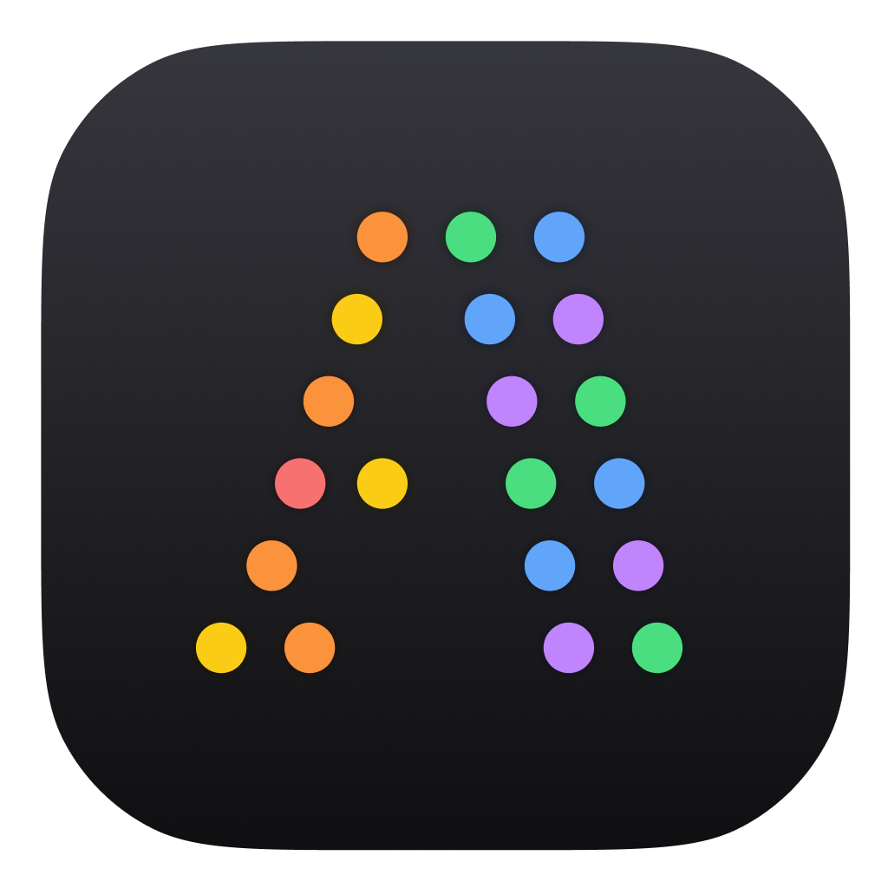

# FontCluster

**FontCluster** is a desktop application that helps you explore and organize your system fonts using machine learning. It visualizes font relationships in a 2D space based on their visual characteristics (HOG features and PaCMAP dimensionality reduction).

## Features

- 🔍 **Font Discovery**: Automatically scans your system for installed fonts.
- 📐 **ML-Powered Analysis**: Uses HOG (Histogram of Oriented Gradients) to characterize font styles.
- 📍 **Interactive Visualization**: Explore your fonts in a cluster map.
- 📂 **Session Management**: Save and restore your font analysis sessions.
- 🎨 **Dark Mode Support**: Beautifully crafted UI for both light and dark environments.

## Website

Visit [fontcluster.mugisus.me](https://fontcluster.mugisus.me) for more information.

## License

Copyright © 2026 mugisus. All rights reserved.
MIT Licensed.
